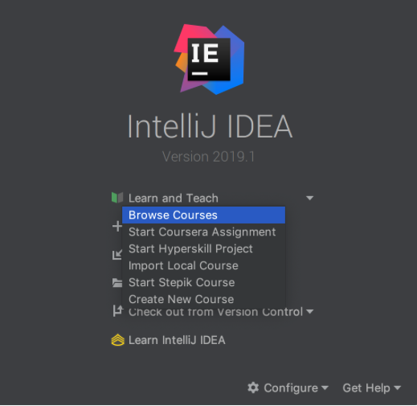
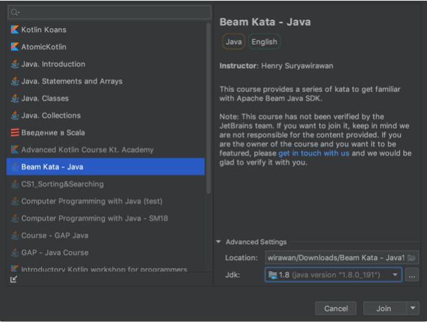

# Hands On With Beam Workshop (writing pipelines)


Welcome to the Intro to Beam Workshop for the Summit in Las Vegas : )
This workshop will explore the basic concepts of the Beam model and the Beam API in Python and Java. Unfortunately, no Go examples, but if you’re interested in the Go SDK, please check out [the Go Quickstart](https://beam.apache.org/get-started/quickstart-go/).

This workshop will be led largely by @pabloem.  @rezarokni, @hashkanna leading the pattern sessions, and a bunch of others from the community helping out with instruction during hands-on sessions.  With @brucearctor.


The schedule is to be as follows:

| TIME | Activity |
| :--- | :--- |
| 11:00 - 12:00 | [Presentation on Beam SDK Tutorial](slides/Beam_sdk_tutorial.pdf)|
| 12:00 - 12:30 |Loading and start working on the Beam Katas |
| 12:30 - 13:30 | Lunch (and work on the Katas with instructors) |
| 13:30 - 14:00 | Patterns from building some real world pipelines: prelude |
| 14:00 - 15:00 | Submitting Beam Jobs; more Katas |
| 15:00 - 15:30 | Coffee Break (and continue above work, if desired/needed) |
| 15:30 - 16:00 | Patterns in building real world pipelines: detail |
| 16:00 - 17:00 | Beam in Production |


## **Requirements and setup** ##

This workshop relies on a few things that we recommend you install beforehand.

**Java Requirements**

If you want to submit Java jobs, you will need to [install Apache Maven](http://maven.apache.org/install.html).

**Python Requirements**

For Python, we use [virtualenv](https://virtualenv.pypa.io/en/latest/installation/) 
to create an isolated environmenti. Also, we rely on 
[docker](https://docs.docker.com/install/linux/docker-ce/ubuntu/) to run jobs on Flink.

**Google Cloud Requirements**

This workshop relies on Google Cloud, so we recommend you install the [`gcloud` utility](https://cloud.google.com/sdk/install) with Storage options as well. Also see link to [interactive installer](https://cloud.google.com/sdk/docs/downloads-interactive).  `gcloud` will be necessary if you want to:

* Submit jobs to Cloud Dataflow

**Operating System Requirements**

The educational materials have been tested by us in Linux, Mac, and Windows.

Please setup the project using Java 8 only.

**IDE Requirements:**

* We rely on some of the JetBrains’ products. Specifically, we use:
  * **For Java:** IntelliJ
    * With the EduTools plugin: 
      https://www.jetbrains.com/education/download/#section=idea
  * **For Python:** PyCharm or IntelliJ with the Python plugin
    * With the EduTools Plugin: 
      https://www.jetbrains.com/education/download/#section=pycharm-edu
      
* If you’re not using the latest IntelliJ or PyCharm, please ensure that the EduTools plugin is version 2.5+

### Setting up Google Cloud account ###

We rely on a Service Account to give you access to Google Cloud utilities, and to submit jobs to Cloud Dataflow. To activate the service account, you can do the following:

```
# Download the keyfile
curl http://beam-summit-berlin-2019.storage.googleapis.com/keys/gcp_keyfile.json -o gcp_keyfile.json

# Activate the service account in the keyfile
gcloud auth activate-service-account --key-file=gcp_keyfile.json

# HACK: Copy to the location for application default credentials.
cp gcp_keyfile.json $HOME/.config/gcloud/application_default_credentials.json
```

If this method will not work for you, you can ask a facilitator to add your email to be one of the users of the project, and then do the following:

```
# Set up the application default credential with your email
gcloud auth application-default login
```

### Opening the Beam Katas ###
1. Upon opening the IDE, you can open the course by clicking "Learn and Teach" > "Browse Courses".
2. Search and select the corresponding course 
* “Beam Kata - Java” for IntelliJ Edu
* “Beam Kata - Python” for PyCharm Edu
3. Select your JDK or Python interpreter by expanding the “Advanced Settings”.
* Please use JDK 8 and Python 2.7 only.
* Then click "Join"
4. You're good to go.
* Note that for the first time, it will take some time to initialize the project.
5. To learn more on how to use the Education product:
* ["How To" IntelliJ Edu](https://www.jetbrains.com/help/education/learner-start-guide.html?section=Introduction%20to%20Java#explore_course)
* ["How To" PyCharm Edu](https://www.jetbrains.com/help/education/learner-start-guide.html?section=Introduction%20to%20Python#explore_course)


See below for detailed screen shots.  




